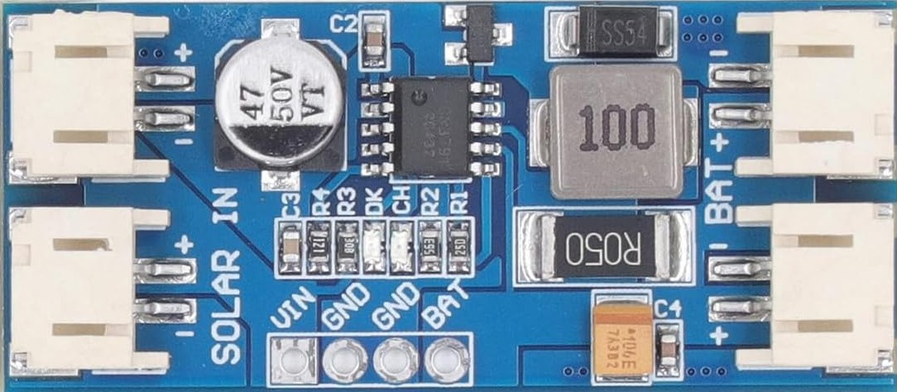

# Liste du matériel / Bill of Materials

Ce projet utilise les composants suivants :

- **1 × Module de charge solaire MPPT CN3791**  
- **1 × Capteur barométrique et thermique BMP280**  
- **1 × Heltec T114 V2** (nRF52840 + SX1262 LoRaWAN) [Heltec](https://heltec.org/project/mesh-node-t114/)
- **1 × Boîtier de batterie 2×18650** — bornes de câblage **PH 2.0**, cellules en **connexion parallèle**  
- **1 × Câble coaxial** avec **connecteur à joint torique Type N femelle → U.FL**  
- **1 × Câble coaxial RG58 – L16 N mâle → N mâle**, longueur **30 cm**
- **1 × Antenne OPA-ANT-FIXE-868-V2-N-1568 (4.4 dBi)**  
- **1 × Panneau solaire 9 W — Voltaic Systems P109-C**  
- **1 × Jeu de fiches DC** pour panneau solaire **3.5 × 1.35 mm**  
- **1 × Tube aluminium** Ø **8 mm ext / 6 mm int**  
- **2 × Presse-étoupes**  
- **1 × Boîtier** (étanche ou semi-étanche selon usage)

---

💡 *Astuce : Pensez à vérifier la polarité des connecteurs DC avant la mise sous tension.*

